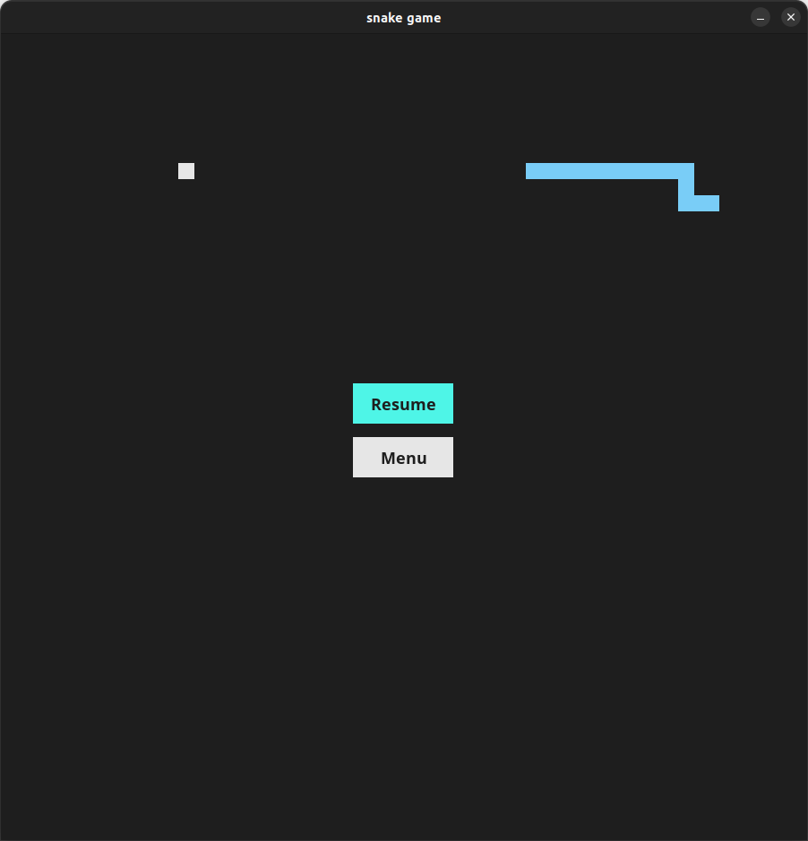
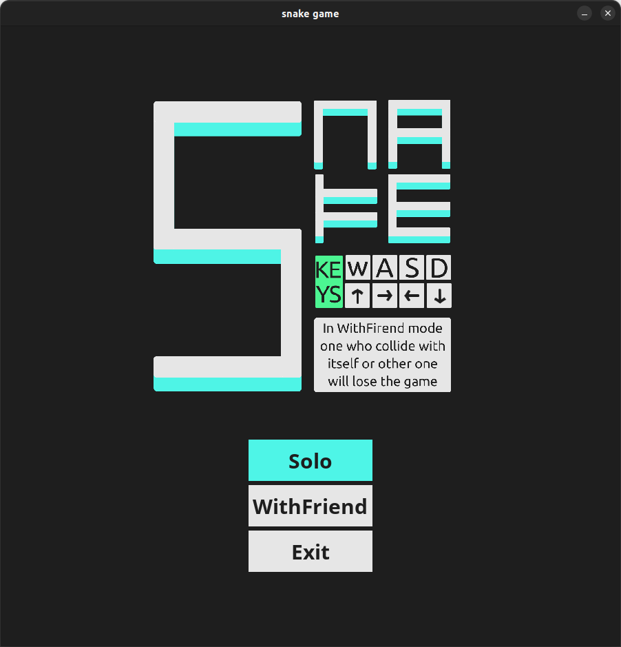
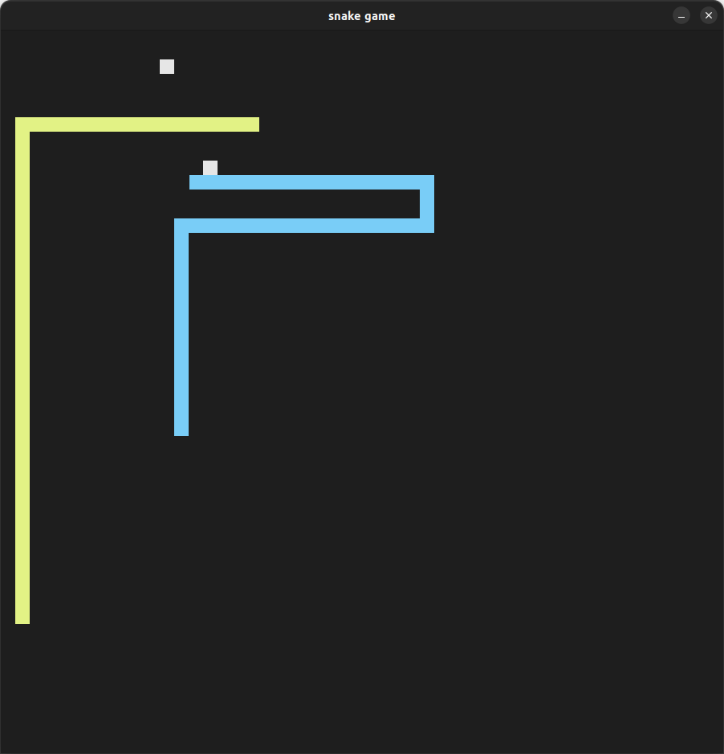

# SNAKE

[](https://forthebadge.com)

This is a simple snake game made with python.
Snake movement is smooth, appearance is simple and appropriate and also there is a two player mode :)

<p float="left" align="center">
  
   
  
</p>

## How to run the game

### Running executable file (Method 1)

For both Windows and Linux an executable file was made using pyinstaller so you can just download and run the game without any Requirements from [Releases](https://github.com/dalmamad/snake-py/releases) Page.

### running the python script (Method 2)

#### Requirements

- Python3
- Pygame

run the **main**.py

```python
python __main__.py
```

## Setting

all setting are in setting.py folder.
if you needed to change the Resolution, change WIN_WIDTH variable to your desire.
note: only when you use Method 2 changing setting will be effective

example:

```python
WIN_WIDTH = 500
```
