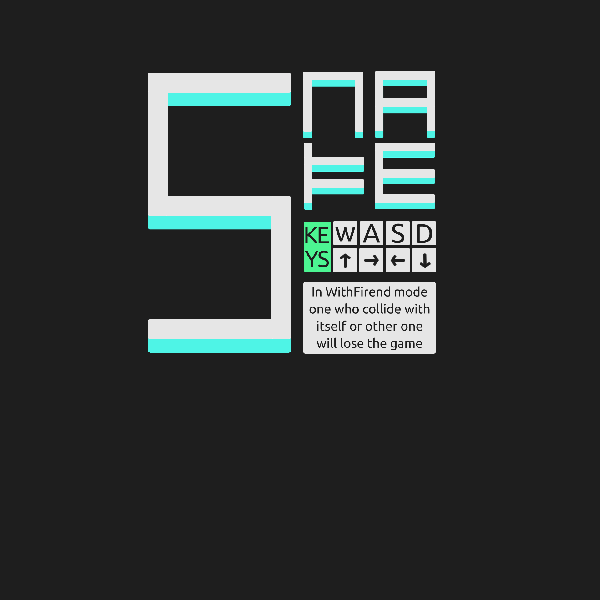

# SNAKE

[](https://forthebadge.com)

This is a simple snake game made in python. i tried to make a neat game with a menu and a appropriate appearance.
Snake movements are smooth and also there is a two player mode so you can play with your friend.

<p align='center'>
	
</p>

## How to run the game

### Running executable file (Method 1)
For both Windows and Linux an executable file was made using pyinstaller so you can run the game without any Requirements.
* for Windows run __main__.exe file in executable folder 
* for linux run __main__ file in executable folder 

### running the python script (Method 2)

#### Requirements
* Python3
* Pygame

run the __main__.py
```python
python __main__.py
```


## Setting
all setting are in setting.py folder.
if you needed to change the Resolution, change WIN_WIDTH variable to your desire.
note: only when you use Method 2 changing setting will be effective

example:
```python
WIN_WIDTH = 500
```

